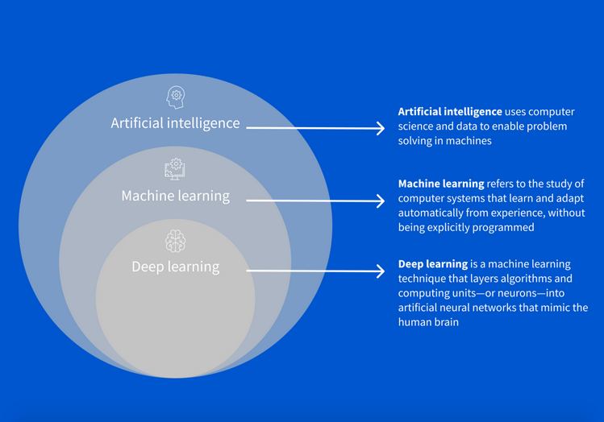

# Грокаем Глубокое обучение

[Grokking-Deep-Learning git](https://github.com/iamtrask/Grokking-Deep-Learning)

## Frameworks

- Torch
- TensorFlow
- Keras

---

### Глубокое обучение - подмножество методов ML

### Глубокое обучение является классом параметрических моделей

---

## Види ML

- **С учителем**
  - Класс алгоритмов обучающихся предсказанию одного набора данных по другому
  - Прямая имитация закономерностей, имеющих место между двумя наборами данных.
  - По одному набору будет спрогнозирован другой.
  - ML с учителем преобразует наборы данных (рекомендации, присутствие, предсказание)
- **БЕЗ учителя**
  - Группирует данные по закономерностям
- **Параметрическое**
  - Характеризуется наличием фиксированного числа параметров
- **НЕ параметрическое**
  - выбирают число параметров, основываясь на даных
  - Имеет бесконечное число параметров (определяется даными)

---

- **Параметрическое** обучние **С учителем**
  - 1 Этап: Прогноз (Данные - Модель - Предсказание)
  - 2 Этап: Сравнение с истиной
  - 3 Этап: Обучение (учитывается величина ошибки)

- **Параметрическое** обучние **БЕЗ учителя**
  - Модели корректируют параметры преобразования входных даных в группы

- **НЕ параметрическое** обучение
  - число параметров зависит от данных (меняется в зависимости от данных)

## Для обучения с учителем и без учителя в глубоком обучении используются нейронные сети
